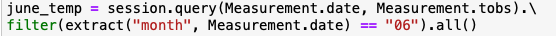
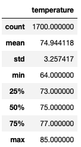
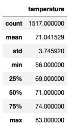
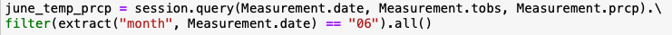
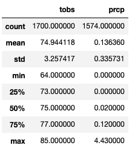

# Surfs_Up Analysis

#
Purpose

##
The purpose of this analysis is to pull temperature data for the months of June and December in Oahu to determine if the surf and ice cream shop business
is sustainable year-round. 

# 
Results

##
For the month of June, temperature observations covered from June 1, 2010 thru June 30, 2017. Total observation count is 1,700. For the month of 
December, temperature observations covered from December 1, 2010 thru December 31, 2016. Total observation count is 1,517.
Based on summary statistics, below are key differences in weather between June and December. 

###
•	Average Temperature: Average temperature in June is approximately 75 degrees as compared to 71 degrees in December. 
•	Minimum Temperature: Minimum temperature in June is 64 degrees as compared to 56 degrees in December. 
•	Maximum Temperature: Maximum temperature in June is 85 degrees as compared to 83 degrees in December.

 

# 
Summary

##
The summary statistics show minor differences in temperature between the month of June and December as noted above. As such, the analysis can be 
further enhanced by including precipitation by month. To do so, the existing query can be updated to include column “prcp”.  

